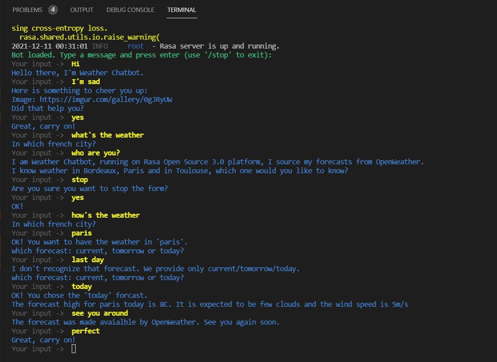

# Weather Chatbot with Rasa 3.0: open source conversational AI

## introduction

This is a weather chatbot powered by rasa 3.0. It can handle many scenarios (happy path, sad/unhappy path, user interruption of a form, user stopping a form ...). Here is an example of interacting with this chatbot.


## Weather data

The weather data format chosen here is defined by OpenWeather (https://openweathermap.org/), which provides weather data freely for developers. 

## Authors

- Houssam Bahhou
- Omar Arif
- Fayçal Mohamed Boullit

## Train the model and run the bot

Train the model with command 

```
rasa train
```

The action "action_wx", need to be started before starting the bot evaluation. To do this you have to runthe file ```actions.py```.

```
rasa run actions
```

Start the discussion with wxbot:

```
rasa shell
```

## Activating OpenWeatherMap API

Set a valid API key in ```wx.py```. API key is available from https://openweathermap.org/

```python
use_openweather_API = True
API_key = "Insert your key here"
```


